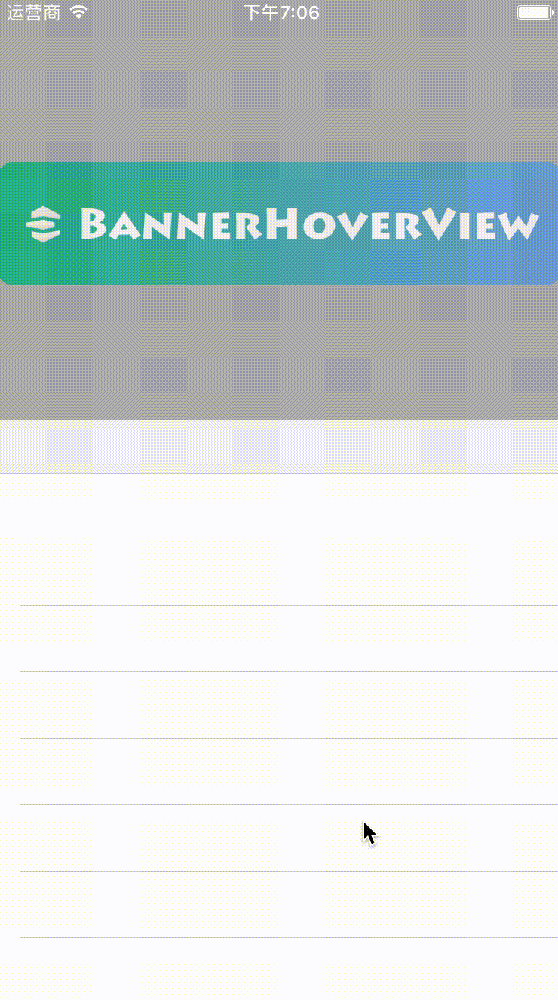

## Description

*BannerHoverView* is made to construct a special view controller layout. This layout is like the screen shot demo. (A header can scroll up and hover in the screen.) I think it is a common layout and I make the header hovered view independent. 

So, quick to build hover view by **BannerHoverView** in iOS development.

## Screenshot




## Usage

### 1. Import BannerHoverView

Please refer to **Install**.

### 2. Definition Derived View

It's like the `SampleView` below:

```swift
class SampleView: BannerHoverView {
    override init(frame: CGRect) {
        super.init(frame: frame)
    }
    
    required init?(coder aDecoder: NSCoder) {
        fatalError("init(coder:) has not been implemented")
    }
}
```

### 3. Use In ViewController

**Property**

```swift
var tableView: UITableView!
var bannerHoverView: SampleView!
```

**Init properties and KVO setting**

```swift
// TableView Initial
tableView = UITableView.init(frame: view.bounds, style: .grouped)
tableView.dataSource = self
tableView.delegate = self

// BannerHoverView Initial
bannerHoverView = SampleView.init(frame: CGRect.init(x: 0, y: 0, width: view.frame.size.width, height: 280))
// Hover Height(Remaining part when BannerHoverView arrived at the top position)
bannerHoverView.top = 65
// Scroll Property Setting
bannerHoverView.headerScrollView = tableView

// Add Observer
tableView.addObserver(bannerHoverView, forKeyPath: "contentOffset", options: NSKeyValueObservingOptions.new, context: nil)
        
view.addSubview(tableView)
view.addSubview(bannerHoverView)
```

**Delete Observer in ViewController**

```swift
deinit {
    tableView.removeObserver(bannerHoverView, forKeyPath: "contentOffset")
}
```

## Install

### 1. Cocoapods

```bash
pod 'BannerHoverView', '~> 0.0.1'
```

And you will get the `BannerHoverView.swift` file. 😎

### 2. Copy the source code in you project

You can copy the `BannerHoverView` folder and its source file `BannerHoverView.swift` in your project.

## MIT License

Copyright (c) 2017 Desgard_Duan

Permission is hereby granted, free of charge, to any person obtaining a copy
of this software and associated documentation files (the "Software"), to deal
in the Software without restriction, including without limitation the rights
to use, copy, modify, merge, publish, distribute, sublicense, and/or sell
copies of the Software, and to permit persons to whom the Software is
furnished to do so, subject to the following conditions:

The above copyright notice and this permission notice shall be included in all
copies or substantial portions of the Software.
